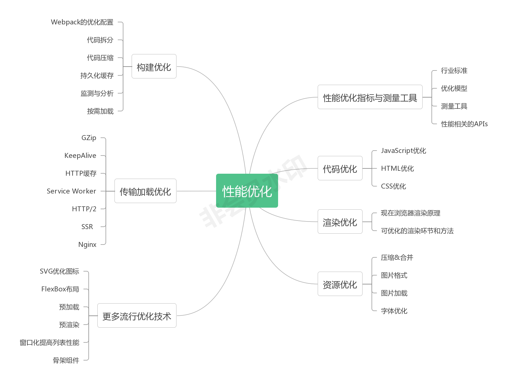

# performance
前端性能优化手册

## 引言
在当下迭代飞快的互联网环境下，性能优劣至关重要，差的性能足以摧毁一个好的网站。

具体到 Web 站点的性能优化，其实后台优化的技术已经比较成熟——比如数据库的优化、后台代码的优化等等。成熟到什么程度呢？很多 Web 网页，真正花费在 Web 服务器到终端用户的时间其实往往不超过整个响应时间的一两成。

相比之下，工程师们对前端性能优化的研究和重视度还远远不够。

就国内的情况来看，许多站点并不关注前端的性能优化，这方面的研究也相对较少。事实上前端的优化空间非常大，谁能把握住这巨大的优化空间，谁就可以为自己的互联网产品争得用户流量的先机。

大家能够发现自己手上的淘宝、京东等页面越来越快，到大厂面试时性能优化也成了一个绕不过去的弯——前端性能优化终于到了手握一个应用体验质量的生杀大权的时代了！单单掌握 React 或者 Vue 以应对基本的业务开发已经不那么 OK 了。作为前端工程师，性能优化已经进化为了我们的必修课之一。

笔者希望借这本小册，尽可能降低一些大家学习性能优化的成本。

一方面，为没有接触过性能优化的新同学建立起一个正确的前端性能优化的“世界观”，从而使性能优化这件事情有迹可循。另一方面，为在职的工程师们提供一线团队已经实践过的“方法论”，形成一个性能优化思路索引表。

整个的知识图谱，用思维导图展示如下：

## 你会学到什么？
学原理，学实践，学会学习。

建立起你自己的前端性能优化知识版图，搞定面试、优化业务。

## 适宜人群
* 具备基本的 JavaScript、CSS 知识，对 webpack 等构建工具有所了解。
* 对前端性能优化感兴趣，但没有过深入了解和实践的同学。
